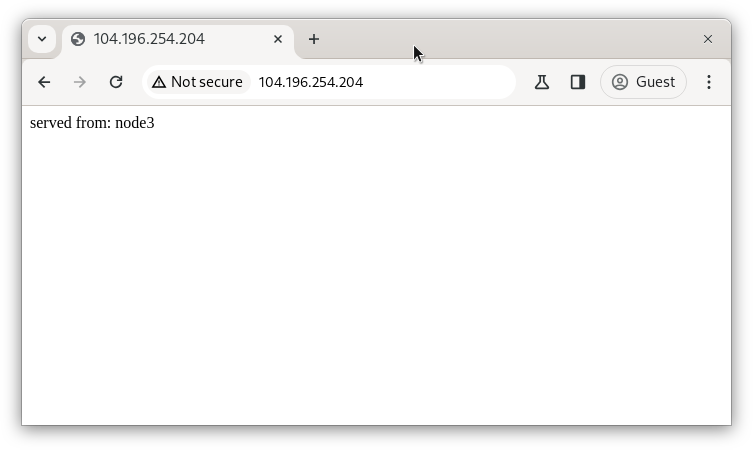
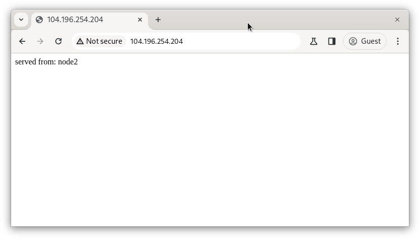

# Technical Test
Dear Technical Team, thanks for your opportunity and give me time to finish the Ansible & Kubernetes Challenge Deployment. In this page, i will to describe how iam try to work the challange appropriate with the requirement in guideline. Lets begin


## Table of Content
- [Ansible](#ansible)
- [Kubernetes](#kubernetes)


## Ansible
### Case Study

1. Create inventory file with group loadbalancer and backend using 3 node.
2. Create playbook to install nginx on all server
3. Create playbook to change nginx index to backend host with contains "served from: hostname"
4. Create playbook to setup nginx in the loadbalancer group with methode "least connection" between nodes in the backend group

### Solution
1. First, for inventory iam create using *.ini extention and private key methode so as we did'n need add hosts password for execute the program

2. Install Nginx, for run this program you can execute that command.
    ```
    ansible-playbook -i inventory.ini nginx-install.yml
    ```

3. Change default nginx page for backend.
    ```
    ansible-playbook -i inventory.ini nginx-page.yml
    ```

4. Setup nginx load balancer.
    ```
    ansible-playbook -i inventory.ini nginx-page.yml
    ```
5. for alternative i can install all part from 1-4 with one file like that.
    ```
    ansible-playbook -i inventory.ini nginx-configlb.yml
    ```


### Result
I'am trying to access public address of node1 (loadbalancer) with some incognito browser and loadbalancer can direct to node2 and node3 (backend) webserver.

<p align="center">

</p>

## Kubernetes
### Case Study

1. Make the worker node join the cluster
2. Create a deployment with Name: nginx-app using container nginx:1.11.10-alpine and 3 replicas
3. Deploy the application with new version 1.11.13-alpine, by performing a rolling update.
4. Rollback that update to the previous version 1.11.10-alpine.
5. Set a node named k8s-node-1 as unavailable and reschedule all the pods running on it.
6. Create a Persistent Volume with name app-data, of capacity 2Gi and access mode ReadWriteMany. The type of volume is hostPath and its location is /srv/app-data.
7. Create a Persistent Volume Claim that requests the Persistent Volume you had created above. The claim should request 2Gi. Ensure that the Persistent Volume Claim has the same storageClassName as the Persistent Volume you had previously created.

### Solution

1. Make the worker node join the cluster, first insert this command on master node
    ```
    sudo kubeadm token create --print-join-command
    ```

    The result show command with credential for worker node, copy this and run in worker node. After that, check the node is join or not in master note.

    <p align="center">
    
    <p>
    
2. Create Deployment nginx-app, for run this program iam execute that command.
    ```
    kubectl apply -f nginx-install.yml
    ```

    After that, for make sure the apps its already running, iam using this command with result.

    <p align="center">
    
    <p>

3. Deploy the application with new version 1.11.13-alpine, for this case iam user the same yml like nginx-install but with change the image version.
    ```
    kubectl apply -f nginx-upgrade.yml --record
    ```
    Alternatively you didn't create new or edit yml, you need only using 1 command like this.
    ```
    kubectl set image deployment/nginx-app nginx=nginx:1.11.13-alpine --record
    ```
    for see the the history of rolling using this command.
    ```
    kubectl rollout history deployment nginx-app
    ```
    <p align="center">
    
    <p>

    Or for verify the version is change, iam can use discribe command
    ```
    kubectl describe deployment/nginx-app
    ```

    <p align="center">
    
    <p>

4. Rollback that update to the previous version 1.11.10-alpine.
    ```
    kubectl rollout undo deployment nginx-app
    ```
    for see the change off that, we can use rollout command like before, and i can see the 3rd revision is the undo update.

    <p align="center">
    
    <p>

5. Set a node named k8s-node-1 as unavailable and reschedule all the pods running on it.
    ```
    kubectl drain k8s-node-1 --ignore-daemonsets
    ```
    Result after runing the command, node can have status **SchedulingDisabled** like this.

    <p align="center">
    
    <p>

6. Create a Persistent Volume with name app-data.
    ```
    kubectl apply -f pvolume.yml
    ```
    for see the volume created, iam using the command.

    <p align="center">
    
    <p>    

7. Create a Persistent Volume Claim that requests the Persistent Volume you had created above.
    ```
    kubectl apply -f pvolumeclaim.yml
    ```
    for see the result, iam using same command like before.

    <p align="center">
    
    <p>


## Conclusion
This project i created in GCP VM Instance, i know maybe my solution didn't perpect but i hope can meet goal expectations for the challange. Thanks Before.

Regards,
Tresna Widiyaman